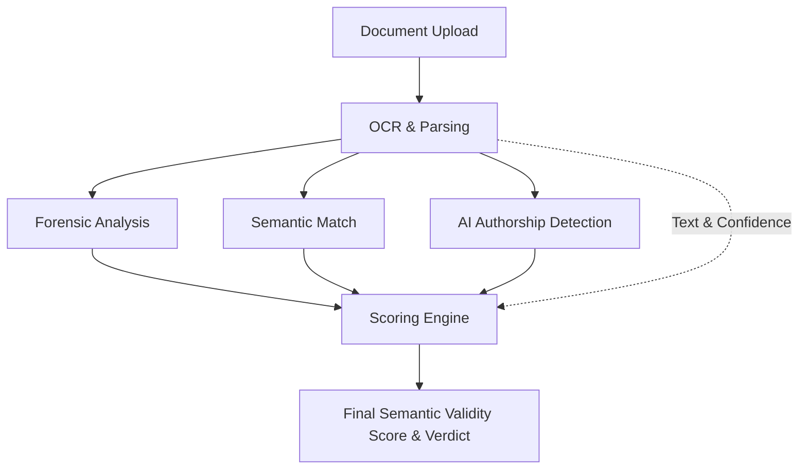

# SafeHire AI - Implementation Plan & Architecture Overview

**SafeHire AI** is an offline, AI-powered document verification system designed for recruitment. Its primary goal is to ensure candidate privacy by processing documents (resumes, certificates, ID proofs) entirely locally without sending data to the cloud. It detects tampered, fake, or AI-generated documents and provides an explainable **Semantic Validity Score**.

This document serves as the implementation plan and architecture overview to help developers fully understand how the application is built and functions under the hood.

---

## 🏗️ System Architecture

The application is designed to run 100% locally and is broken down into two main interfaces that share the same core backend modules:

1. **FastAPI Backend + Custom Web UI (`api.py` & `frontend/index.html`)**
   - Exposes a REST API (`POST /api/verify`) to process documents programmatically.
   - Serves a bespoke HTML/CSS/JS frontend ("Verification Desk") on `/` for a modern, animated web experience.
2. **Streamlit Application (`app.py`)**
   - An alternative, Python-native dashboard for quick visualization, tweaking weights, and presenting the tool.

### Core Processing Pipeline

Whenever a document is uploaded, it flows through a linear pipeline of 5 core modules:

---

## 🧩 Module Breakdown

### 1. OCR & Parsing (`modules/ocr_parser.py`)
- **Purpose**: Extracts text and layout information from uploaded images or PDFs.
- **Technologies**: `PyMuPDF` (for PDF handling) and `pytesseract` / Tesseract OCR (for text extraction).
- **Output**: Raw extracted text and a confidence score representing the legibility and quality of the text.

### 2. Forensic Analysis (`modules/forensics.py`)
- **Purpose**: Detects visual tampering or image manipulation.
- **Technologies**: `Pillow`, `NumPy`, `OpenCV`.
- **Techniques**:
  - **Error Level Analysis (ELA)**: Highlights areas of an image with differing compression levels (indicating something might have been pasted or edited).
  - **Metadata Integrity**: Checks EXIF data for anomalies (e.g., modified dates, missing origin data).
- **Output**: Forensic integrity score, ELA heatmap image, and metadata red flags.

### 3. Semantic Match (`modules/semantic_match.py`)
- **Purpose**: Verifies if the content "reads" like the expected document type (e.g., does this look like a real ID or a resume?).
- **Technologies**: `scikit-learn`.
- **Techniques**: Uses TF-IDF vectorization and Cosine Similarity against a set of predefined reference templates for different document types.
- **Output**: A semantic relevance score out of 100.

### 4. AI Authorship Detection (`modules/ai_detector.py`)
- **Purpose**: Determines if the text was written by a human or generated/modified by an AI (like ChatGPT).
- **Techniques**: Analyzes stylometric heuristics:
  - **Burstiness**: Variation in sentence length and structure.
  - **Type-Token Ratio (TTR)**: Vocabulary richness.
  - *(Future Upgrade Path)*: Local LLM (e.g., Ollama/qwen2.5) for perplexity-based detection.
- **Output**: Human-likelihood score and AI-generation flags.

### 5. Scoring Engine (`modules/scorer.py`)
- **Purpose**: Aggregates the results from all modules into a single, explainable verdict.
- **Techniques**: Uses a weighted average formula. The default weights emphasize semantic match and forensics, but these can be adjusted dynamically in the UI.
- **Output**: Final Score (0-100%), detailed breakdown of contributing factors, and a final Verdict (e.g., "Authentic", "Suspicious").

---

## 🚀 Setup & Execution Flow

### 1. Installation (`install.bat` & `requirements.txt`)
- Automates the creation of a Python virtual environment (`venv`).
- Installs Python dependencies (FastAPI, Streamlit, OpenCV, scikit-learn, etc.).
- Automatically fetches and installs the system-level Tesseract OCR engine using Windows `winget`.

### 2. Startup (`start_app.bat`)
- Activates the virtual environment.
- Launches the FastAPI application via `uvicorn api:app --reload`.
- (Alternatively, the Streamlit app can be launched via `streamlit run app.py`).
